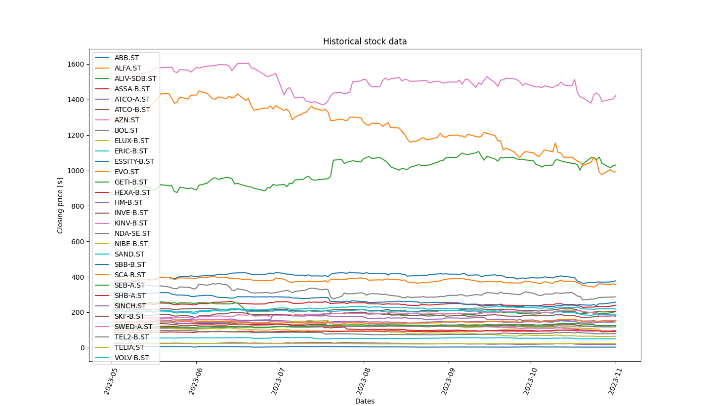
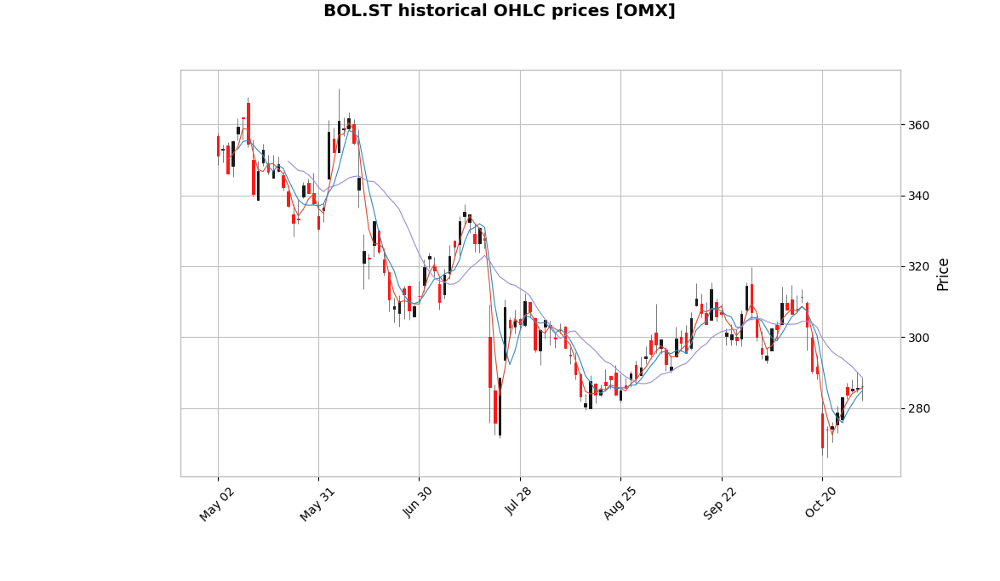
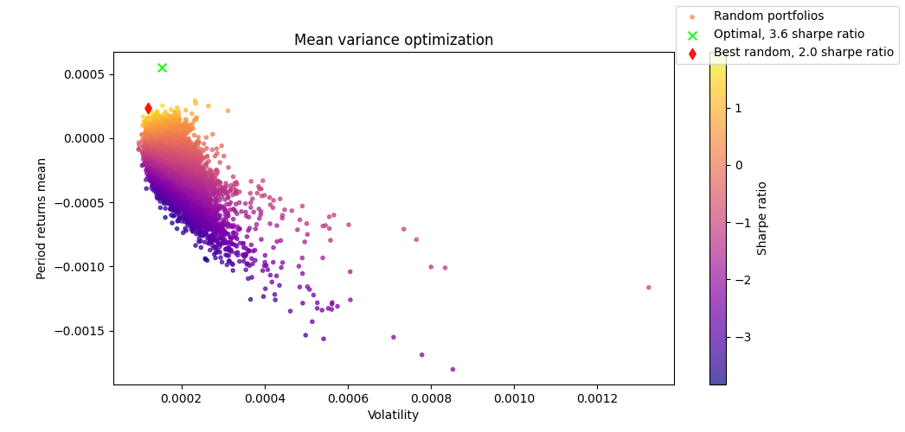

<div align="center">
<br/>
<div align="left">
<br/>
<p align="center">
<a href="https://github.com/wilhelmagren/finq">
</img>
</a>
</p>
</div>

[](https://pypi.org/project/pyfinq)
[](https://opensource.org/licenses/MIT)
[](https://codecov.io/gh/wilhelmagren/finq)
[](https://github.com/wilhelmagren/finq/actions/workflows/ci.yml)
[](https://github.com/wilhelmagren/finq/actions/workflows/cd.yml)
[](https://github.com/wilhelmagren/finq/actions/workflows/tests.yml)
[](https://github.com/psf/black)
[](https://github.com/astral-sh/ruff)
[](https://python-poetry.org/)

</div>

## 🔎 Overview
The goal of *finq* is to provide an all-in-one Python library for **quantitative portfolio analysis and optimization** on historical and real-time financial data.

**NOTE:** Features are currently being determined and developed continuously. The repo is undergoing heavy modifications and could introduce **breaking changes** up until first major release. Current version is **v0.3.0**.

## 📦 Installation
Either clone this repository and perform a local install with [poetry](https://github.com/python-poetry/poetry/tree/master) accordingly
```
git clone https://github.com/wilhelmagren/finq.git
cd finq
poetry install
```
or install the most recent release from the Python Package Index (PyPI).
```
pip install pyfinq
```

## 🚀 Example usage
*finq* supports a large number of major world indices which can be used through their respective `Dataset` implementation. To download all ticker OHLC data for a period and saving it locally for the `OMXS30` index, you can do the following:
```python
from finq.datasets import OMXS30

dataset = OMXS30(save=True)
dataset.run("2y")

```

The `.run(period)` function is a convenient wrapper for three other functions. The alternative way would be by running:
```python
dataset.fetch_data("2y").fix_missing_data().verify_data()
```

and for a full list of all implemented indices, please take a look at the following [link](https://github.com/wilhelmagren/finq/blob/ade0e4ca064b08190131d013d6230c4d74be4986/finq/datasets/__init__.py).

You can also define custom datasets, which may not be an already available major world index. To do that you need to use the `CustomDataset` and provide both a list of security names and their ticker symbols
which are to be included in your dataset. Furthermore, you need to specify what market the ticker symbols are available on, e.g., `NASDAQ` or `OMX`. In code it can look like this:

```python
from finq.datasets import CustomDataset

names = ["Alfa Laval", "Boliden", "SEB A", "Sv. Handelsbanken A"]
symbols = ["ALFA.ST", "BOL.ST", "SEB-A.ST", "SHB-A.ST"]

dataset = CustomDataset(names, symbols, market="OMX", save=False)
dataset = dataset.run("6mo")
...

```

The `Dataset` class supports visualizing any OHLC historical data for all considered tickers. Calling the `.visualize(price_type="Close")` function on the OMXS30 index would yield the following plot:
<details>
<summary>Show dataset plot</summary>
    

    
</details>

and the majority of labels and styles for the plot can be customized regularly with [matplotlib](https://matplotlib.org/) styling. You can also choose to visualize more advanced plots, but only for individual assets,
through the [mplfinance](https://github.com/matplotlib/mplfinance) library. The below image is a `candle` plot of the **BOL.ST** ticker from the **OMXS30** index, with three moving averages.

<details>
    <summary>Show ticker plot</summary>


    
</details>

---
You can create a `Portfolio` in a large number of ways. The most convenient way is to first initialize a `Dataset` like above, and then pass that dataset to the portfolio class constructor. The class also supports passing in
a list of `Asset` objects, or a `np.ndarray`, or a `pd.DataFrame`. But for the latter three alternatives you need to also provide the security names and ticker symbols from which the data came from.
All different methods are showed in the snipper below:

```python
from finq import Portfolio

# All four alternatives are equally viable.
# The latter three are implemented for whenever
# you preferably only want to work with local data.
from_dataset = Portfolio(dataset)
from_assets = Portfolio(assets, names=["SEB-A.ST", ...], symbols=...)
from_numpy = Portfolio(np_arr, names=["SEB-A.ST", ...], symbols=...)
from_pandas = Portfolio(pd_df, names=["SEB-A.ST", ...], symbols=...)
...

```

To optimize your portfolio against some objective function, you use the `optimize(...)` function. Optimizing the mean variance expression (maximizing sharpe ratio) requires you to specify the 
objective function that you want to *minimize*, the initial weights of your portfolio, optionally the bounds and constraints of the portfolio weights. You can do it in the following way:

```python
from finq import Portfolio
from finq.datasets import OMXS30
from finq.formulas import mean_variance

dataset = OMXS30(save=True)
dataset = dataset.run("2y")

portfolio = Portfolio(dataset)
portfolio.initialize_random_weights(
    "lognormal",
    size=(len(dataset), 1),
)

risk_tolerance = 1

portfolio.set_objective_function(
    mean_variance,
    risk_tolerance * portfolio.daily_covariance(),
    portfolio.daily_returns_mean(),
)

portfolio.set_objective_bounds(
    [(0, 0.2) for _ in range(len(dataset))],
)

portfolio.optimize(
    method="COBYLA",
    options={"maxiter": 1000},
)

portfolio.plot_mean_variance(n_samples=10000, figsize=(8, 5))
```

The above code is directly taken from one of the scripts available in the [examples](./examples) directory in this repo. Running it can yield the following comparative plot of the sharpe ratios for: your *optimized* portfolio weights,
and randomly sampled portfolio weights.

<details>
    <summary>Show sharpe ratio plot</summary>


    
</details>

## 📋 License
All code is to be held under a general MIT license, please see [LICENSE](https://github.com/wilhelmagren/finq/blob/main/LICENSE) for specific information.
